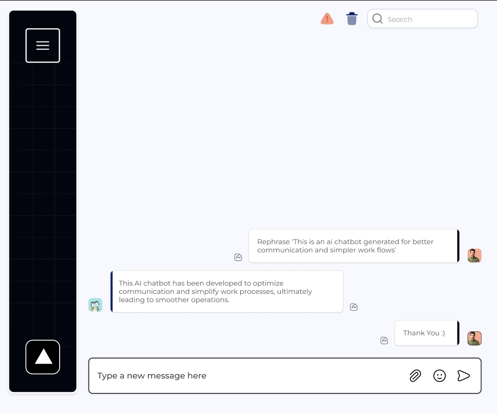

### Things to do 
1. Do pull request to get this README.md file to avoid git conflict / done

2. Create a nextJS project as you did for project 2 or watch the video / done
3. Decide if you want to continue with JAVASCRIPT or PYTHON (I am okay with both, if we do python some of the code can be reused since I worked with LLM and Langchain Before) 
/ frontend next.js we can do python back

- If you want to continue with JS, watch the full video headstarter AI
- Otherwise I will provide with resources for python to catch you up.
4. Design a frontend page and login page and registration page
5. If you decide to go with JS, make sure to watch most of the JS videos on Resource page in Headstarter Project 3, How to work with LLM and How to do good prompting.

Client side Setup:

In this project we are building an AI Customer Service Support. 
To start off we have a figma design that we are basing our project on. 

1. Animation when app is loading
2. sign in/sign up page
3. Work on regular frontend chatbox
